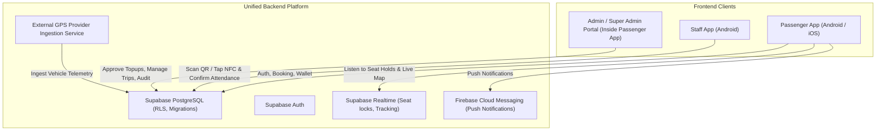

# 00 — Project Overview

## 1. System Vision & Architecture
Amomy Bus is a modern, high-reliability bus transportation platform designed for scheduled passenger transit. The ecosystem consists of two separate applications sharing a unified backend infrastructure:

1. **Passenger App (This Project)**
   - Target Platforms: **Android & iOS**
   - Target Audience: Daily commuters, students, workers, and monthly subscribers.
   - Core Features: Schedule browsing, atomic seat selection and booking, Points wallet & recharge requests, QR boarding pass, live bus tracking during trips, push notifications, and a protected internal **Admin / Super Admin** dashboard.

2. **Staff App (Separate Project)**
   - Target Platforms: **Android only**
   - Target Audience: Onboarding staff, conductors, and station operators.
   - Core Features: Rapid QR code scanning, physical NFC card touch reading, ticket validation, and mandatory manual attendance confirmation.

---

## 2. Core Operational Ecosystem

---

## 3. Technology Stack

| Layer | Technology | Rationale |
| :--- | :--- | :--- |
| **Framework** | Flutter 3.x (Dart 3) | Single codebase for Android and iOS with native performance |
| **State Management** | BLoC / Cubit | Predictable, reactive, testable state separation |
| **Architecture** | Clean Architecture (Feature-First) | Decoupled presentation, domain, and data layers |
| **Dependency Injection**| GetIt + Injectable | Automated compile-time code generation for IoC container |
| **Routing** | GoRouter | Declarative routing with path parameters and guard hooks |
| **Networking** | Dio + PrettyDioLogger | Resilient HTTP requests with interceptors and structured logging |
| **Backend & Database** | Supabase (PostgreSQL, Storage, Realtime) | Row-Level Security, migrations, atomic PostgreSQL functions |
| **Push Notifications**| Firebase Cloud Messaging (FCM) | Reliable cross-platform messaging and updates |
| **Local Storage** | SharedPreferences & FlutterSecureStorage | Encrypted credential storage & local preferences |
| **Loading UX** | Skeletonizer | Premium shimmer skeleton layouts over standard spinners |
| **Localization** | flutter_localizations + intl (ARB) | Native Arabic (RTL) & English (LTR) support from Day 1 |
