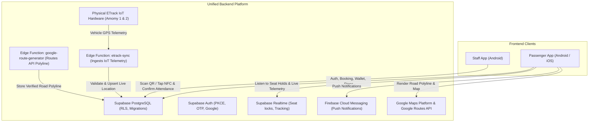

# 00 — Project Overview

## 1. System Vision & Architecture
Amomy Bus is a modern, high-reliability bus transportation platform designed for scheduled passenger transit on the Mit Ghamr / Mit Fadala – Mansoura corridor in Egypt. The ecosystem consists of two applications sharing a unified backend infrastructure:

1. **Passenger App (This Project)**
   - Target Platforms: **Android & iOS**
   - Target Audience: Daily commuters, university students, workers, and monthly subscribers.
   - Core Features: Today-only schedule browsing (4 outbound, 4 return runs), 28-seat interactive bus cabin map with 5-minute atomic holds, dynamic 3-zone stop pricing (30, 25, 20 pts), Points wallet & recharge requests (minimum 200 PTS), QR boarding pass, live Google Maps bus tracking with road-following geometry, arrival events, duplicate booking protection, and cancellation/seat-swap support.

2. **Staff App (Separate Project)**
   - Target Platforms: **Android only**
   - Target Audience: Onboarding staff, conductors, and station operators.
   - Core Features: Rapid QR code scanning, physical NFC card touch reading, ticket validation, and mandatory manual attendance confirmation.

---

## 2. Core Operational Ecosystem

---

## 3. Technology Stack

| Layer | Technology | Rationale |
| :--- | :--- | :--- |
| **Framework** | Flutter 3.x (Dart 3) | Single codebase for Android and iOS with native 60fps performance |
| **State Management** | BLoC / Cubit | Predictable, reactive, testable state separation |
| **Architecture** | Clean Architecture (Feature-First) | Decoupled presentation, domain, and data layers |
| **Dependency Injection**| GetIt + Injectable | Automated compile-time code generation for IoC container |
| **Routing** | GoRouter | Declarative routing with path parameters and auth guards |
| **Networking** | Dio + PrettyDioLogger | Resilient HTTP requests with interceptors and structured logging |
| **Backend & Database** | Supabase (PostgreSQL, Storage, Realtime) | Row-Level Security, migrations, atomic PostgreSQL functions |
| **Map Rendering** | Google Maps Platform (`google_maps_flutter`) | Official SDK, default Google Maps palette, custom vector markers |
| **Route Geometry** | Google Routes API (Edge Function) | Stored road-following polylines replacing straight-line interpolation |
| **GPS Telemetry** | ETrack VIP IoT Hardware (Edge Function) | Automated backend-authoritative ingestion for Amomy 1 & 2 only |
| **Local Storage** | SharedPreferences & FlutterSecureStorage | Encrypted credential storage & local preferences |
| **Loading UX** | Skeletonizer | Premium shimmer skeleton layouts over standard spinners |
| **Localization** | flutter_localizations + intl (ARB) | Native Arabic (RTL) & English (LTR) support from Day 1 |

---
**Last Updated**: 2026-09-14
