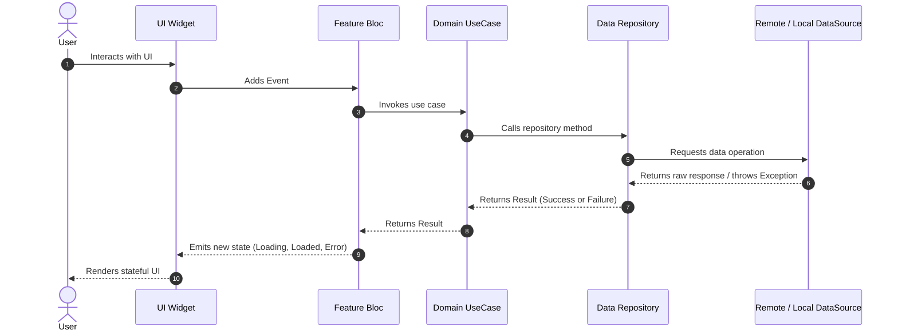

# 01 — System Architecture

## 1. Architectural Philosophy
Amomy Bus follows **Clean Architecture** combined with a **Feature-First** modular organization. Business rules are independent of frameworks, UI libraries, database clients, or third-party SDKs.

```
       Presentation Layer (UI, Pages, Widgets, BLoC / Cubit)
                                 │
                                 ▼
       Domain Layer (Entities, Use Cases, Repository Contracts)
                                 ▲
                                 │
       Data Layer (Models, Repositories Impl, Data Sources: Remote/Local)
```

---

## 2. Layer Responsibilities

### 2.1. Domain Layer (Pure Dart)
- **Entities**: Pure domain representations of business objects with identity and immutable values. Must have no framework dependencies.
- **Repositories (Contracts)**: Abstract interfaces defining data operations returning `ResultFuture<T>`.
- **Use Cases**: Single-responsibility business actions executed by the presentation layer (e.g., `CheckAppStatusUseCase`, `HoldSeatUseCase`, `ConfirmBookingUseCase`).

### 2.2. Data Layer
- **Models**: Data Transfer Objects (DTOs) with serialization/deserialization logic (`fromJson`, `toJson`), extending or mapping to Domain Entities.
- **Data Sources**:
  - `RemoteDataSource`: Direct calls to Supabase, REST APIs, or Edge Functions.
  - `LocalDataSource`: Key-value persistence (Preferences, Secure Storage, SQLite/Cache).
- **Repository Implementations**: Coordinates one or multiple data sources, catches data-layer exceptions, and maps them to domain `Failure` instances.

### 2.3. Presentation Layer
- **BLoC / Cubit**: Emits immutable states in response to user intents or system events.
- **Pages**: Top-level route destinations wrapped with `BlocProvider` and `BlocConsumer`/`BlocBuilder`.
- **Widgets**: Reusable, atomic UI components without direct access to repositories or data sources.

---

## 3. Data Flow & Boundary Constraints



### Strict Boundary Rules
1. **Widgets never call Repositories or DataSources directly.**
2. **Data-layer exceptions are caught in Repositories and converted to Domain `Failure`s.**
3. **No business logic in UI widgets.**
4. **Third-party types (Dio `Response`, Supabase `PostgrestResponse`) never cross into the Domain or Presentation layer.**

---

## 4. Feature Architecture & State Machines

### 4.1. Authentication State Machine
- Handled by `AuthBloc`.
- Flow: `SplashPage` -> `AuthCheckRequested` -> `Authenticated` / `Unauthenticated` / `EmailVerificationRequired` / `ProfileCompletionRequired`.
- Session token persistence across app launches.

### 4.2. Booking & Seat Selection State Machine
- Handled by `BookingCubit` & `SeatMapCubit`.
- Flow:
  1. Direction & Today Trip selection (Outbound / Return, Cairo timezone).
  2. Boarding Stop Selection from 34 route stops (resolves dynamic fare zone 30/25/20 PTS).
  3. Interactive 28-Seat Bus Map selection.
  4. Atomic 5-Minute Hold Creation (`create_booking_hold` RPC locks seat and reserves points).
  5. Booking Review & Confirmation (`confirm_booking` RPC permanently debits points with frozen snapshot).
  6. QR Ticket Pass Generation (`BookingQrTicketCard`).

### 4.3. Live GPS Tracking & Progression Engine
- Handled by `TrackingCubit`, `LiveBusMapWidget`, and `StopEtaEngine`.
- Realtime subscription on `bus_live_locations` and `trip_stop_events`.
- Active operational windows: 08:00–12:00 and 13:00–17:00 (offline display outside windows).
- Stored road-following polyline rendering from `route_geometries`.
- Monotonic stop arrival detection and ETA calculation.
- UI stop pin states: Last Stop (yellow), Next Stop (blue), Future (white), Older (muted).

### 4.4. Points Wallet & Top-up Flow
- Handled by `WalletCubit` and `TopupCubit`.
- Realtime wallet balance caching (`wallets.cached_available_balance`).
- Double-entry ledger history from `point_transactions`.
- Manual top-up request with screenshot proof upload (`payment-proofs` private bucket) and resubmission support.

---
**Last Updated**: 2026-09-14


