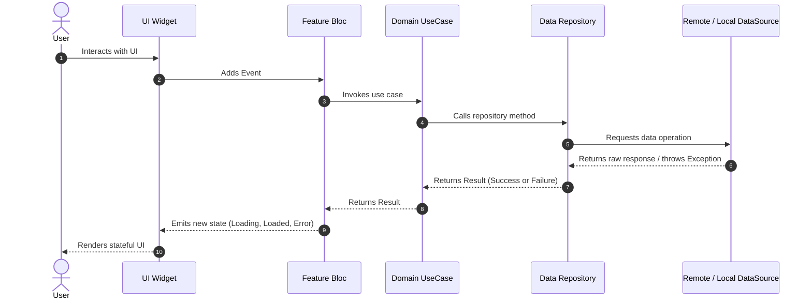

# 01 — System Architecture

## 1. Architectural Philosophy
Amomy Bus follows **Clean Architecture** combined with a **Feature-First** modular organization. Business rules are independent of frameworks, UI libraries, database clients, or third-party SDKs.

```
       Presentation Layer (UI, Pages, Widgets, BLoC / Cubit)
                                 │
                                 ▼
       Domain Layer (Entities, Use Cases, Repository Contracts)
                                 ▲
                                 │
       Data Layer (Models, Repositories Impl, Data Sources: Remote/Local)
```

---

## 2. Layer Responsibilities

### 2.1. Domain Layer (Pure Dart)
- **Entities**: Pure domain representations of business objects with identity and immutable values. Must have no framework dependencies.
- **Repositories (Contracts)**: Abstract interfaces defining data operations returning `ResultFuture<T>`.
- **Use Cases**: Single-responsibility business actions executed by the presentation layer (e.g., `CheckAppStatusUseCase`, `HoldSeatUseCase`, `ConfirmBookingUseCase`).

### 2.2. Data Layer
- **Models**: Data Transfer Objects (DTOs) with serialization/deserialization logic (`fromJson`, `toJson`), extending or mapping to Domain Entities.
- **Data Sources**:
  - `RemoteDataSource`: Direct calls to Supabase, REST APIs, or Edge Functions.
  - `LocalDataSource`: Key-value persistence (Preferences, Secure Storage, SQLite/Cache).
- **Repository Implementations**: Coordinates one or multiple data sources, catches data-layer exceptions, and maps them to domain `Failure` instances.

### 2.3. Presentation Layer
- **BLoC / Cubit**: Emits immutable states in response to user intents or system events.
- **Pages**: Top-level route destinations wrapped with `BlocProvider` and `BlocConsumer`/`BlocBuilder`.
- **Widgets**: Reusable, atomic UI components without direct access to repositories or data sources.

---

## 3. Data Flow & Boundary Constraints



### Strict Boundary Rules
1. **Widgets never call Repositories or DataSources directly.**
2. **Data-layer exceptions are caught in Repositories and converted to Domain `Failure`s.**
3. **No business logic in UI widgets.**
4. **Third-party types (Dio `Response`, Supabase `PostgrestResponse`) never cross into the Domain or Presentation layer.**

---

## 4. Authentication & Session Architecture (Day 2B)

### 4.1. Supported Authentication Providers
- **Email + Password**: Full Name, Email, Egyptian Phone, Gender, Date of Birth. Passes metadata to Supabase `signUp()`. Triggers backend `handle_new_user()` to instantiate profiles, wallets, and roles.
- **Google Native Sign-In**: Native Google OAuth on Android and iOS exchanging ID Token with Supabase (`signInWithIdToken()`). If required profile fields (`phone`, `gender`, `date_of_birth`) are missing, routing intercepts to `CompleteProfilePage`.
- **6-Digit Email OTP Verification**: Real token verification via Supabase `verifyOTP(email: ..., token: ..., type: OtpType.signup)`.
- **Secure Password Recovery**: Deep-link token exchange (`com.aliabdelnaser.amomy://login-callback`) triggering `ResetPasswordPage`.

### 4.2. Auth State Machine
```
[SplashPage] ─► AuthCheckRequested
                     │
         ┌───────────┴───────────┐
         ▼                       ▼
   [Unauthenticated]       [Authenticated] (or Incomplete)
         │                       │
   (Login / Register)            ├─► EmailUnverified ──► [EmailVerificationPage]
                                 ├─► ProfileIncomplete ──► [CompleteProfilePage]
                                 └─► Valid Session ──► [PassengerHomePlaceholder]
```

